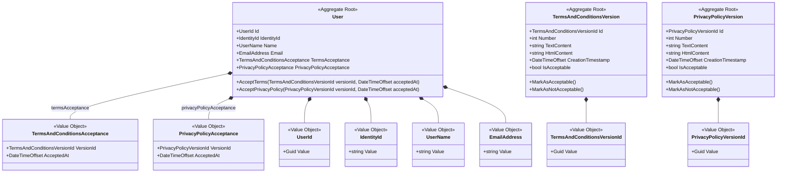

```mermaid
classDiagram
direction TB

class User {
  <<Aggregate Root>>
  +UserId Id
  +IdentityId IdentityId
  +UserName Name
  +EmailAddress Email
  +TermsAndConditionsAcceptance TermsAcceptance
  +PrivacyPolicyAcceptance PrivacyPolicyAcceptance
  +AcceptTerms(TermsAndConditionsVersionId versionId, DateTimeOffset acceptedAt)
  +AcceptPrivacyPolicy(PrivacyPolicyVersionId versionId, DateTimeOffset acceptedAt)
}

class TermsAndConditionsVersion {
  <<Aggregate Root>>
  +TermsAndConditionsVersionId Id
  +int Number
  +string TextContent
  +string HtmlContent
  +DateTimeOffset CreationTimestamp
  +bool IsAcceptable
  +MarkAsAcceptable()
  +MarkAsNotAcceptable()
}

class PrivacyPolicyVersion {
  <<Aggregate Root>>
  +PrivacyPolicyVersionId Id
  +int Number
  +string TextContent
  +string HtmlContent
  +DateTimeOffset CreationTimestamp
  +bool IsAcceptable
  +MarkAsAcceptable()
  +MarkAsNotAcceptable()
}

class TermsAndConditionsAcceptance {
  <<Value Object>>
  +TermsAndConditionsVersionId VersionId
  +DateTimeOffset AcceptedAt
}

class PrivacyPolicyAcceptance {
  <<Value Object>>
  +PrivacyPolicyVersionId VersionId
  +DateTimeOffset AcceptedAt
}

class UserId {
  <<Value Object>>
  +Guid Value
}

class IdentityId {
  <<Value Object>>
  +string Value
}

class UserName {
  <<Value Object>>
  +string Value
}

class EmailAddress {
  <<Value Object>>
  +string Value
}

class TermsAndConditionsVersionId {
  <<Value Object>>
  +Guid Value
}

class PrivacyPolicyVersionId {
  <<Value Object>>
  +Guid Value
}

User *-- TermsAndConditionsAcceptance : termsAcceptance
User *-- PrivacyPolicyAcceptance : privacyPolicyAcceptance

User *-- UserId
User *-- IdentityId
User *-- UserName
User *-- EmailAddress

TermsAndConditionsVersion *-- TermsAndConditionsVersionId

PrivacyPolicyVersion *-- PrivacyPolicyVersionId
```