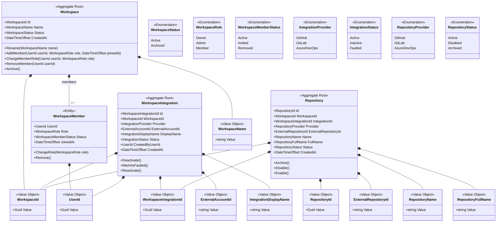

```mermaid
classDiagram
direction TB

class Workspace {
  <<Aggregate Root>>
  +WorkspaceId Id
  +WorkspaceName Name
  +WorkspaceStatus Status
  +DateTimeOffset CreatedAt
  +Rename(WorkspaceName name)
  +AddMember(UserId userId, WorkspaceRole role, DateTimeOffset joinedAt)
  +ChangeMemberRole(UserId userId, WorkspaceRole role)
  +RemoveMember(UserId userId)
  +Archive()
}

class WorkspaceMember {
  <<Entity>>
  +UserId UserId
  +WorkspaceRole Role
  +WorkspaceMemberStatus Status
  +DateTimeOffset JoinedAt
  +ChangeRole(WorkspaceRole role)
  +Remove()
}

class WorkspaceIntegration {
  <<Aggregate Root>>
  +WorkspaceIntegrationId Id
  +WorkspaceId WorkspaceId
  +IntegrationProvider Provider
  +ExternalAccountId ExternalAccountId
  +IntegrationDisplayName DisplayName
  +IntegrationStatus Status
  +UserId CreatedByUserId
  +DateTimeOffset CreatedAt
  +Deactivate()
  +MarkAsFaulted()
  +Reactivate()
}

class Repository {
  <<Aggregate Root>>
  +RepositoryId Id
  +WorkspaceId WorkspaceId
  +WorkspaceIntegrationId IntegrationId
  +RepositoryProvider Provider
  +ExternalRepositoryId ExternalRepositoryId
  +RepositoryName Name
  +RepositoryFullName FullName
  +RepositoryStatus Status
  +DateTimeOffset CreatedAt
  +Archive()
  +Disable()
  +Enable()
}

class WorkspaceId {
  <<Value Object>>
  +Guid Value
}

class WorkspaceName {
  <<Value Object>>
  +string Value
}

class WorkspaceIntegrationId {
  <<Value Object>>
  +Guid Value
}

class RepositoryId {
  <<Value Object>>
  +Guid Value
}

class ExternalAccountId {
  <<Value Object>>
  +string Value
}

class IntegrationDisplayName {
  <<Value Object>>
  +string Value
}

class ExternalRepositoryId {
  <<Value Object>>
  +string Value
}

class RepositoryName {
  <<Value Object>>
  +string Value
}

class RepositoryFullName {
  <<Value Object>>
  +string Value
}

class UserId {
  <<Value Object>>
  +Guid Value
}

class WorkspaceStatus {
  <<Enumeration>>
  Active
  Archived
}

class WorkspaceRole {
  <<Enumeration>>
  Owner
  Admin
  Member
}

class WorkspaceMemberStatus {
  <<Enumeration>>
  Active
  Invited
  Removed
}

class IntegrationProvider {
  <<Enumeration>>
  GitHub
  GitLab
  AzureDevOps
}

class IntegrationStatus {
  <<Enumeration>>
  Active
  Inactive
  Faulted
}

class RepositoryProvider {
  <<Enumeration>>
  GitHub
  GitLab
  AzureDevOps
}

class RepositoryStatus {
  <<Enumeration>>
  Active
  Disabled
  Archived
}

Workspace *-- WorkspaceId
Workspace *-- WorkspaceName
Workspace *-- "0..*" WorkspaceMember : members

WorkspaceMember *-- UserId

WorkspaceIntegration *-- WorkspaceIntegrationId
WorkspaceIntegration *-- WorkspaceId
WorkspaceIntegration *-- ExternalAccountId
WorkspaceIntegration *-- IntegrationDisplayName
WorkspaceIntegration *-- UserId

Repository *-- RepositoryId
Repository *-- WorkspaceId
Repository *-- WorkspaceIntegrationId
Repository *-- ExternalRepositoryId
Repository *-- RepositoryName
Repository *-- RepositoryFullName
```