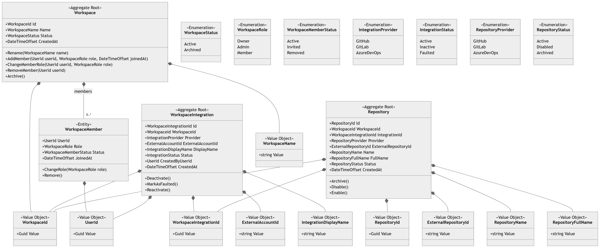

[↩️](./../../../README.md)

# Workspace domain

## Workspace aggregate
Responsibility for:
- create workspace
- add/remove members
- access role management
- guards ownership
- limits and policies

Business rules:
- must have a name
- must have owner
- user can't be assigned twice (or more)
- only user with specified role can manage and access workspace's resources

## Integration aggregate
Responsibility for:
- represents connection with VCS
- external systems authentication and authorization
- provides repositories
- policies 

Business rules:
- bolongs to only one workspace
- same VCS can't be assigned to same workspace
- can be active, unactive or broken

## Repository aggregate
Responsibility for:
- represents single reposiotry
- provides code for analyze
- code review configuration

Business rules:
- belongs to only one workspace
- must be assigned to integration in same workspace
- external repository can't be added twice (or more) to same workspace
- reposiotry can be active, unactive or archived

