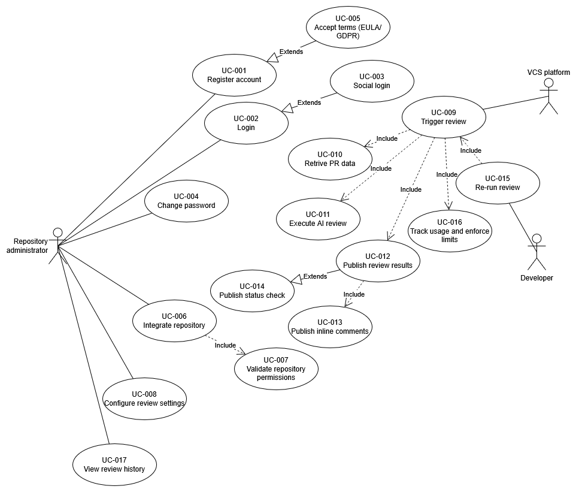

[↩️](../README.md)

# Use cases
## Use case list
| ID       | Name                            | Actor                    | Includes                     | Extends  |
| -------- | ------------------------------- | ------------------------ | ---------------------------- | -------- |
| `UC-001` | Register account                | Repository administrator | -                            |          |
| `UC-002` | Login                           | Repository administrator | -                            |          |
| `UC-003` | Social login                    | Repository administrator | -                            | `UC-002` |
| `UC-004` | Change password                 | Repository administrator | -                            |          |
| `UC-005` | Accept terms (EULA/GDPR)        | Repository administrator | -                            | `UC-001` |
| `UC-006` | Integrate repository            | Repository administrator | `UC-007`                     |          |
| `UC-007` | Validate repository permissions | System                   | -                            |          |
| `UC-008` | Configure review settings       | Repository administrator | -                            |          |
| `UC-009` | Trigger review                  | VCS Platform / Developer | `UC-010`, `UC-011`, `UC-012`, `UC-016` |          |
| `UC-010` | Retrieve PR data                | System                   | -                            |          |
| `UC-011` | Execute AI review               | System                   | -                            |          |
| `UC-012` | Publish review results          | System                   | `UC-013`                     | `UC-014` |
| `UC-013` | Publish inline comments         | System                   | -                            |          |
| `UC-014` | Publish status check            | System                   | -                            |          |
| `UC-015` | Re-run review                   | Developer                | `UC-009`                     |          |
| `UC-016` | Track usage & enforce limits    | System                   | -                            |          |
| `UC-017` | View review history             | Repository administrator | -                            |          |

## Use case diagram
